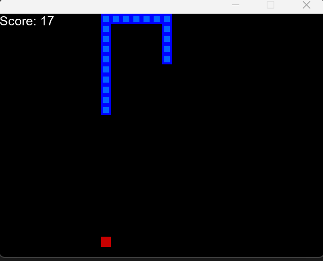
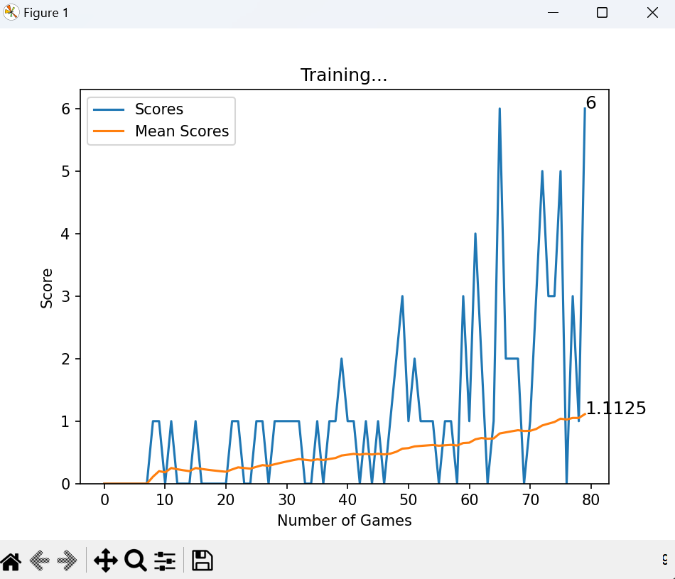

# 🐍 Snake Game AI - Reinforcement Learning with PyTorch

This project is a classic **Snake game** implemented using **Pygame**, trained with a **Deep Q-Network (DQN)** agent using **PyTorch**. The AI learns how to play Snake from scratch through self-play using reinforcement learning techniques.

---

## 🎮 Demo



---

## 🧠 How It Works

The AI agent learns using the **Deep Q-Learning** algorithm:
- **State Space (11 features)**: Danger detection, current direction, and food location.
- **Action Space (3 actions)**: [Straight, Right, Left]
- **Reward Mechanism**:
  - `+10` for eating food
  - `-10` for dying
  - `0` for regular move
- **Experience Replay**: Uses a memory buffer to sample random experiences for stable training.
- **Neural Network**:
  - Input: 11 neurons
  - Hidden Layer: 200 neurons (ReLU)
  - Output: 3 neurons (Q-values for actions)

---

## 📈 Live Plotting

The training progress (score & mean score) is visualized in real-time using `matplotlib`.



---

## 🧪 Requirements

- Python ≥ 3.7
- PyTorch
- Pygame
- Matplotlib
- NumPy

  ### 🔁 1. Clone the Repository

```bash
git clone https://github.com/abhaymani421/SnakeGame_ReinforcementLearning.git
cd SnakeGame_ReinforcementLearning
```

  ### 🐍 2. Create and Activate the Conda Environment

```bash
conda create -n pygame_env python=3.7
conda activate pygame_env
```

  ### 📦 3. Install Required Packages

```bash
pip install pygame torch torchvision matplotlib ipython
```

  ### 🚀 4. Run the Game or Training Script

```bash
python agent.py
```
